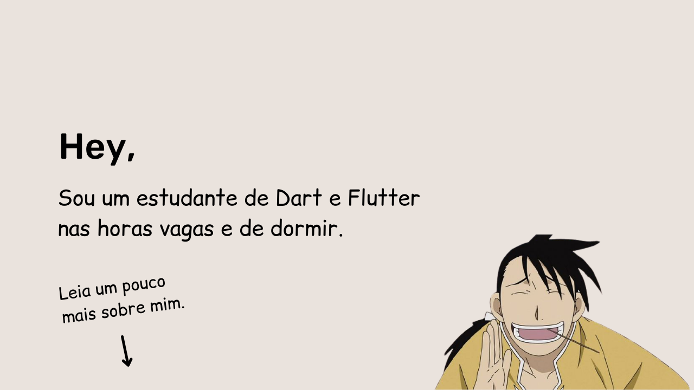

# Olá, :stuck_out_tongue:
Gosto de programar e de tentar fazer isso minha arte, acho que o fato de querer entender como o fluxo das coisas funcionam
foi o que me incentivou a continuar a estudar a computação.

### Algumas linguagens de que tenho conhecimento:

- Dart / Flutter.
- Bash Scripting
- C / C++
-  Html
- Css
- Javascript

### Contate-me

