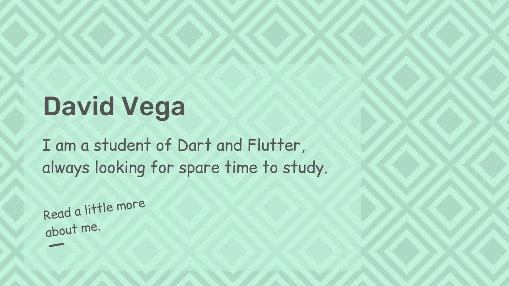

### A little about myself :
Currently studying Dart and Flutter, I am interested in InfoSec, AI and Quantum Computing, but it is a lot to learn in one life, I think it does not happen ...

The languages that I like and dominate the most are: __C / Dart__, I intend to learn __C ++__ this year, who knows :roll_eyes:.

I don't know what else to write, I think I'll end here, if you want to get in touch, my social networks are below.

